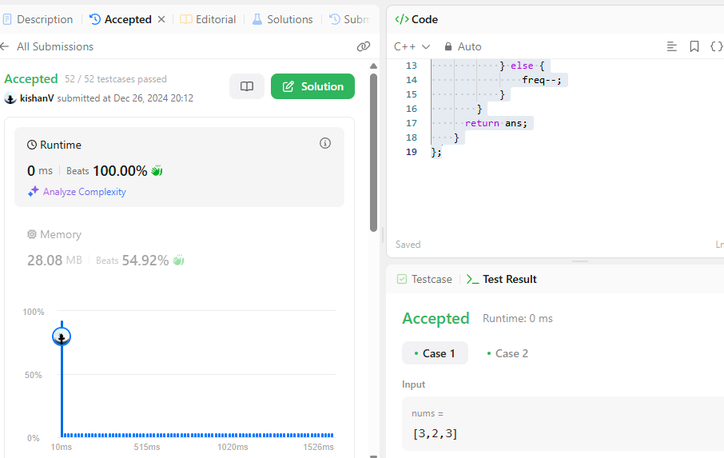
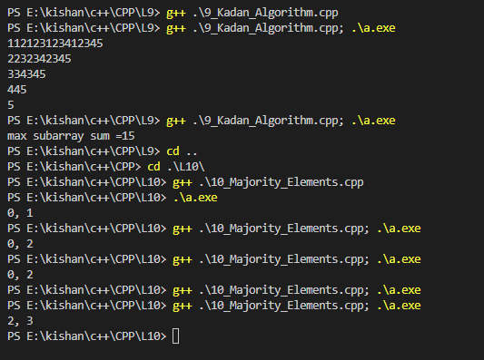

### **Majority Element: Brute, Better, and Best Approaches** 🚀  

The **Majority Element** in an array is the element that appears more than \( \frac{n}{2} \) times, where \( n \) is the size of the array.  

---

### **Problem Statement: Pair Sum**  
Given a sorted array and a target value, return all pairs of elements whose sum equals the target value. Also, return their indices.  

---

### **Approaches: Brute, Better, and Best**  

#### **1️⃣ Brute Force Approach**  
- Iterate through all possible pairs of the array using nested loops.  
- Check if the sum of each pair equals the target.  
- Time Complexity: \( O(n^2) \)  

**Code Example (Pair Sum):**  
```cpp  
vector<pair<int, int>> pairSumBrute(vector<int>& nums, int target) {  
    vector<pair<int, int>> result;  

    for (int i = 0; i < nums.size(); i++) {  
        for (int j = i + 1; j < nums.size(); j++) {  
            if (nums[i] + nums[j] == target) {  
                result.push_back({nums[i], nums[j]});  
            }  
        }  
    }  

    return result;  
}  
```  

---

#### **2️⃣ Optimized Approach: Two Pointer**  
- Use two pointers: one at the start and one at the end of the array.  
- Compare the sum of the two pointed elements with the target.  
  - If the sum equals the target, store the pair.  
  - If the sum is less than the target, move the left pointer.  
  - If the sum is greater than the target, move the right pointer.  
- Time Complexity: \( O(n) \)  

**Code Example (Pair Sum):**  
```cpp  
vector<pair<int, int>> pairSumTwoPointer(vector<int>& nums, int target) {  
    vector<pair<int, int>> result;  
    int left = 0, right = nums.size() - 1;  

    while (left < right) {  
        int sum = nums[left] + nums[right];  

        if (sum == target) {  
            result.push_back({nums[left], nums[right]});  
            left++;  
            right--;  
        } else if (sum < target) {  
            left++;  
        } else {  
            right--;  
        }  
    }  

    return result;  
}  
```  

---

### **Finding Majority Element**  

#### **1️⃣ Brute Force Approach**  
- Count the frequency of each element using nested loops.  
- If the frequency of any element is greater than \( \frac{n}{2} \), return that element.  
- Time Complexity: \( O(n^2) \)  

**Code Example:**  
```cpp  
int majorityElementBrute(vector<int>& nums) {  
    int n = nums.size();  

    for (int val : nums) {  
        int freq = 0;  

        for (int el : nums) {  
            if (el == val) {  
                freq++;  
            }  
        }  

        if (freq > n / 2) {  
            return val;  
        }  
    }  

    return -1;  
}  
```  

---

#### **2️⃣ Better Approach: Sorting**  
- Sort the array.  
- Iterate through the array and count the frequency of consecutive elements.  
- Return the element whose frequency exceeds \( \frac{n}{2} \).  
- Time Complexity: \( O(n \log n) \)  

**Code Example:**  
```cpp  
int majorityElementSort(vector<int>& nums) {  
    int n = nums.size();  
    sort(nums.begin(), nums.end());  

    int freq = 1, ans = nums[0];  
    for (int i = 1; i < n; i++) {  
        if (nums[i] == nums[i - 1]) {  
            freq++;  
        } else {  
            freq = 1;  
            ans = nums[i];  
        }  

        if (freq > n / 2) {  
            return ans;  
        }  
    }  

    return ans;  
}  
```  

---

#### **3️⃣ Best Approach: Moore’s Voting Algorithm**  
- Use a counter (`freq`) to track the majority element.  
- Traverse the array:  
  - If the counter is `0`, assign the current element as the candidate.  
  - If the current element matches the candidate, increment the counter.  
  - Otherwise, decrement the counter.  
- Time Complexity: \( O(n) \)  

**Code Example:**  
```cpp  
int majorityElementMoore(vector<int>& nums) {  
    int freq = 0, ans = 0;  

    for (int num : nums) {  
        if (freq == 0) {  
            ans = num;  
        }  
        if (num == ans) {  
            freq++;  
        } else {  
            freq--;  
        }  
    }  

    return ans;  
}  
```  

---

### **Comparison of Approaches**  

| **Approach**         | **Time Complexity** | **Space Complexity** | **Key Idea**                                         |  
|-----------------------|---------------------|-----------------------|-----------------------------------------------------|  
| Brute Force           | \( O(n^2) \)       | \( O(1) \)            | Count frequency for each element using nested loops.|  
| Sorting               | \( O(n \log n) \)  | \( O(1) \)            | Sort and count consecutive elements.                |  
| Moore’s Voting Algo   | \( O(n) \)         | \( O(1) \)            | Maintain a candidate and update frequency.          |  

---

### **Problem Link**  
[Majority Element - LeetCode](https://leetcode.com/problems/majority-element/)  

---

### **Key Takeaways**  
1. Always aim to optimize your solutions based on time and space complexity.  
2. Moore’s Voting Algorithm is the most efficient approach for the **Majority Element** problem.  
3. For **Pair Sum**, the **two-pointer approach** is highly efficient when the array is sorted.  

### **outputs** <br>
<table>
  <tr>
    <td></td>
    <td></td>  
  </tr>
     
Happy Coding! 😊✨  