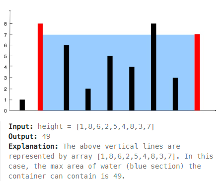

### **Array Question: Compute \( \text{pow}(x, n) \)** 🚀  

---

### **Problem Description**  
We need to calculate \( x^n \) efficiently using the **Binary Exponentiation** approach.  

---

### **Binary Exponentiation**  

#### **Concept**  
1. **Binary Form of Exponent**: The idea is to use the binary representation of \( n \) to minimize the number of multiplications.  
2. **Key Observation**:  
   \[
   x^n = 
   \begin{cases} 
   x^{n/2} \times x^{n/2} & \text{if } n \text{ is even} \\
   x^{n/2} \times x^{n/2} \times x & \text{if } n \text{ is odd}
   \end{cases}
   \]  

3. **Negative Exponent**:  
   - If \( n < 0 \), convert \( x^n \) to \( (1/x)^{-n} \).  
4. **Base Cases**:  
   - If \( n = 0 \), \( x^n = 1 \).  
   - Handle other edge cases explicitly for optimized computation.  

---

### **Code**  
```cpp  
#include <iostream>  
using namespace std;  

double myPow(double x, int n) {  
    // Handle base cases  
    if (n == 0) return 1.0;  
    if (x == 0) return 0.0;  
    if (x == 1) return 1.0;  
    if (x == -1 && n % 2 == 0) return 1.0;  
    if (x == -1 && n % 2 != 0) return -1.0;  

    // Handle negative exponent  
    long binForm = n;  // Use long to prevent overflow  
    if (n < 0) {  
        x = 1 / x;  
        binForm = -binForm;  
    }  

    // Binary exponentiation  
    double result = 1.0;  
    while (binForm > 0) {  
        if (binForm % 2 == 1) {  // If the current bit is 1  
            result *= x;  
        }  
        x *= x;  // Square the base  
        binForm /= 2;  // Shift right in binary  
    }  

    return result;  
}  

int main() {  
    cout << myPow(2.0, 10) << endl;  // Outputs: 1024  
    cout << myPow(2.0, -2) << endl;  // Outputs: 0.25  
    return 0;  
}  
```  

---

### **Explanation**  

#### **Binary Form of Exponent**  
- Binary representation allows us to break the problem into smaller subproblems.  
- Example: \( 2^{10} = (2^5)^2 \).  

---

#### **Handling Corner Cases**  
| **Condition**            | **Explanation**                                   | **Result** |  
|---------------------------|---------------------------------------------------|------------|  
| \( n = 0 \)               | Any number to the power of 0 is 1.               | \( 1.0 \)  |  
| \( x = 0 \)               | 0 raised to any power is 0.                      | \( 0.0 \)  |  
| \( x = 1 \)               | 1 raised to any power is 1.                      | \( 1.0 \)  |  
| \( x = -1, n \% 2 = 0 \)  | \( -1 \) raised to an even power is 1.           | \( 1.0 \)  |  
| \( x = -1, n \% 2 \neq 0 \) | \( -1 \) raised to an odd power is -1.          | \( -1.0 \) |  

---

### **Handling Negative Exponent**  
- \( x^{-n} = \frac{1}{x^n} \).  
- Convert \( n \) to positive and flip \( x \) to \( \frac{1}{x} \).  

---

### **Complexity Analysis**  

1. **Time Complexity**:  
   - The while loop runs for \( \log_2(n) \) iterations (binary representation).  
   - Each iteration performs a constant amount of work.  
   \[
   O(\log n)
   \]  

2. **Space Complexity**:  
   - Constant extra space for variables.  
   \[
   O(1)
   \]  

---

### **Practice Link**  
[LeetCode: Pow(x, n)](https://leetcode.com/problems/powx-n/description/)  

---
### **Best Time to Buy and Sell Stock** 🚀  

---

### **Problem Description**  
Given an array `prices[]` where `prices[i]` is the price of a stock on the \( i^{th} \) day, determine the **maximum profit** you can achieve by buying and selling once.  

---

### **Approach to Solve the Problem**  

#### **1️⃣ Key Insight**  
- To maximize profit:  
  - **Buy** at the lowest price.  
  - **Sell** at the highest price *after* the buying day.  

---

#### **2️⃣ Optimal Approach**: Single Pass  
- Track the **minimum price** seen so far.  
- Calculate the profit for each day by subtracting the minimum price from the current price.  
- Update the **maximum profit** whenever a higher profit is found.  

---

### **Code**  

```cpp  
#include <iostream>  
#include <vector>  
#include <climits>  // For INT_MAX  
using namespace std;  

int maxProfit(vector<int>& prices) {  
    int minPrice = INT_MAX;  // Minimum price seen so far  
    int maxProfit = 0;       // Maximum profit  

    for (int price : prices) {  
        // Update minimum price if a lower price is found  
        minPrice = min(minPrice, price);  

        // Calculate profit and update maxProfit  
        int profit = price - minPrice;  
        maxProfit = max(maxProfit, profit);  
    }  

    return maxProfit;  
}  

int main() {  
    vector<int> prices = {7, 1, 5, 3, 6, 4};  
    cout << "Maximum Profit: " << maxProfit(prices) << endl;  // Outputs: 5  
    return 0;  
}  
```  

---

### **Explanation with Example**  

#### **Prices**: [7, 1, 5, 3, 6, 4]  
- **Step 1**: Initialize `minPrice = INT_MAX`, `maxProfit = 0`.  
- **Step 2**: Iterate through each price:  
  - Day 1: \( \text{price} = 7 \), \( \text{minPrice} = 7 \), \( \text{profit} = 7 - 7 = 0 \), \( \text{maxProfit} = 0 \).  
  - Day 2: \( \text{price} = 1 \), \( \text{minPrice} = 1 \), \( \text{profit} = 1 - 1 = 0 \), \( \text{maxProfit} = 0 \).  
  - Day 3: \( \text{price} = 5 \), \( \text{profit} = 5 - 1 = 4 \), \( \text{maxProfit} = 4 \).  
  - Day 4: \( \text{price} = 3 \), \( \text{profit} = 3 - 1 = 2 \), \( \text{maxProfit} = 4 \).  
  - Day 5: \( \text{price} = 6 \), \( \text{profit} = 6 - 1 = 5 \), \( \text{maxProfit} = 5 \).  
  - Day 6: \( \text{price} = 4 \), \( \text{profit} = 4 - 1 = 3 \), \( \text{maxProfit} = 5 \).  

---

### **Complexity Analysis**  

1. **Time Complexity**:  
   - Single loop through the array.  
   \[
   O(n)
   \]  

2. **Space Complexity**:  
   - Constant space for variables.  
   \[
   O(1)
   \]  

---

### **Edge Cases**  
1. **No Profit Possible**:  
   - Example: \( \text{prices} = [7, 6, 5, 4, 3, 2] \).  
   - Output: \( 0 \) (since prices are decreasing).  

2. **Single Day**:  
   - Example: \( \text{prices} = [5] \).  
   - Output: \( 0 \) (cannot sell without buying).  

3. **All Days Same Price**:  
   - Example: \( \text{prices} = [3, 3, 3, 3] \).  
   - Output: \( 0 \) (no profit).  

---

### **Link**  
[LeetCode: Best Time to Buy and Sell Stock](https://leetcode.com/problems/best-time-to-buy-and-sell-stock/description/)  

### **Container With Most Water** 🚀  

---

### **Problem Description**  
Given an array `height[]`, where `height[i]` represents the height of a vertical line at index \( i \), find two lines that together with the x-axis form a container that holds the most water.  

---

### **Mathematical Representation**  
The amount of water that a container can hold is determined by:  
\[
\text{Water} = \text{Width} \times \text{Height}
\]  
- **Width**: The distance between the two chosen lines (\( \text{right} - \text{left} \)).  
- **Height**: The shorter of the two heights (\( \min(\text{height[left]}, \text{height[right]}) \)).  

---

### **Constraints**  
1. \( n == \text{height.length} \).  
2. \( 2 \leq n \leq 10^5 \).  
3. \( 0 \leq \text{height[i]} \leq 10^4 \).  

---

### **Approaches**  

#### **1️⃣ Brute Force Approach**  
- Check all possible pairs of lines to calculate the water they can contain.  
- Keep track of the maximum water encountered.  

**Code**:  
```cpp  
int maxAreaBrute(vector<int>& height) {  
    int maxWater = 0;  
    int n = height.size();  

    for (int i = 0; i < n; i++) {  
        for (int j = i + 1; j < n; j++) {  
            int width = j - i;  
            int ht = min(height[i], height[j]);  
            int currWater = width * ht;  
            maxWater = max(maxWater, currWater);  
        }  
    }  

    return maxWater;  
}  
```  

**Time Complexity**:  
- \( O(n^2) \): Two nested loops.  

**Space Complexity**:  
- \( O(1) \): Constant space usage.  

**Drawback**:  
- Inefficient for large arrays; time limit exceeded for \( n > 10^3 \).  

---

#### **2️⃣ Optimized Approach: Two-Pointer Method**  

**Idea**:  
- Start with the widest container (leftmost and rightmost lines).  
- Use two pointers:  
  - \( \text{lp} \) (left pointer) at the start.  
  - \( \text{rp} \) (right pointer) at the end.  
- Calculate the water contained.  
- Move the pointer corresponding to the shorter line inward to potentially find a taller line.  

**Code**:  
```cpp  
class Solution {  
public:  
    int maxArea(vector<int>& height) {  
        int maxWater = 0;  
        int lp = 0, rp = height.size() - 1;  

        while (lp < rp) {  
            // Calculate width and height  
            int width = rp - lp;  
            int ht = min(height[lp], height[rp]);  

            // Update the maximum water  
            int currWater = width * ht;  
            maxWater = max(maxWater, currWater);  

            // Move the pointer with the smaller height  
            if (height[lp] < height[rp])  
                lp++;  
            else  
                rp--;  
        }  

        return maxWater;  
    }  
};  
```  

---

### **Explanation with Example**  

#### **Input**:  
`height = [1,8,6,2,5,4,8,3,7]`  

#### **Step-by-Step Execution (Two Pointers)**  

| Left Pointer (\( \text{lp} \)) | Right Pointer (\( \text{rp} \)) | Width (\( \text{rp} - \text{lp} \)) | Height (\( \min(\text{height[lp]}, \text{height[rp]} \)) | Water (\( \text{width} \times \text{height} \)) | Max Water |  
|--------------------------------|---------------------------------|------------------------------------|----------------------------------------------------------|------------------------------------------------|-----------|  
| 0                              | 8                               | 8                                  | 1                                                        | 8                                              | 8         |  
| 1                              | 8                               | 7                                  | 7                                                        | 49                                             | 49        |  
| 1                              | 7                               | 6                                  | 3                                                        | 18                                             | 49        |  
| 1                              | 6                               | 5                                  | 8                                                        | 40                                             | 49        |  
| 1                              | 5                               | 4                                  | 5                                                        | 20                                             | 49        |  
| 1                              | 4                               | 3                                  | 5                                                        | 15                                             | 49        |  
| 1                              | 3                               | 2                                  | 2                                                        | 4                                              | 49        |  
| 1                              | 2                               | 1                                  | 6                                                        | 6                                              | 49        |  

---

### **Complexity Analysis**  

1. **Time Complexity**:  
   - Single loop with two pointers.  
   \[
   O(n)
   \]  

2. **Space Complexity**:  
   - Constant space for variables.  
   \[
   O(1)
   \]  

---

### **Edge Cases**  

1. **Two Lines Only**:  
   - \( \text{height} = [1, 2] \).  
   - Output: \( 1 \).  

2. **All Heights Zero**:  
   - \( \text{height} = [0, 0, 0] \).  
   - Output: \( 0 \).  

3. **One Very Tall Line**:  
   - \( \text{height} = [1, 100, 1] \).  
   - Output: \( 2 \) (container width = 2, height = 1).  

---

### **Key Takeaways**  

1. **Brute Force**: Inefficient for large arrays due to \( O(n^2) \).  
2. **Two-Pointer Approach**: Optimized to \( O(n) \), scalable for large inputs.  
3. **Always Move the Smaller Pointer**: Maximizes the chance of increasing the container's height.  

---

### **Problem Link**  
[LeetCode: Container With Most Water](https://leetcode.com/problems/container-with-most-water/)  
### **Product of Array Except Self** 🚀  

---

### **Problem Description**  
Given an integer array `nums[]`, return an array `result[]` such that:  
\[
\text{result[i]} = \text{product of all elements in } \text{nums[] except } \text{nums[i]}
\]  

#### **Constraints**:  
1. \( 2 \leq \text{nums.length} \leq 10^5 \)  
2. \( -30 \leq \text{nums[i]} \leq 30 \)  
3. The product of any prefix or suffix of `nums` fits in a 32-bit integer.  

---

### **1️⃣ Brute Force Approach**  

#### **Idea**  
- For each element `nums[i]`, calculate the product of all elements except `nums[i]` using a nested loop.  

**Code**:  
```cpp  
class Solution {  
public:  
    vector<int> productExceptSelf(vector<int>& nums) {  
        int n = nums.size();  
        vector<int> ans(n, 1);  

        for (int i = 0; i < n; i++) {  
            for (int j = 0; j < n; j++) {  
                if (i != j) {  
                    ans[i] *= nums[j];  
                }  
            }  
        }  

        return ans;  
    }  
};  
```  

#### **Time Complexity**  
- Two nested loops → \( O(n^2) \).  
- **Drawback**: **TLE (Time Limit Exceeded)** for large inputs.  

#### **Space Complexity**  
- \( O(n) \): Output array.  

---

### **2️⃣ Optimized Approach with Prefix and Suffix Arrays**  

#### **Idea**  
1. Use two auxiliary arrays:  
   - `prefix[i]`: Product of all elements before `i`.  
   - `suffix[i]`: Product of all elements after `i`.  
2. Calculate `result[i]` as:  
   \[
   \text{result[i]} = \text{prefix[i]} \times \text{suffix[i]}
   \]  

**Code**:  
```cpp  
class Solution {  
public:  
    vector<int> productExceptSelf(vector<int>& nums) {  
        int n = nums.size();  
        vector<int> ans(n, 1);  
        vector<int> prefix(n, 1);  
        vector<int> suffix(n, 1);  

        // Compute prefix products  
        for (int i = 1; i < n; i++) {  
            prefix[i] = prefix[i - 1] * nums[i - 1];  
        }  

        // Compute suffix products  
        for (int i = n - 2; i >= 0; i--) {  
            suffix[i] = suffix[i + 1] * nums[i + 1];  
        }  

        // Combine prefix and suffix products  
        for (int i = 0; i < n; i++) {  
            ans[i] = prefix[i] * suffix[i];  
        }  

        return ans;  
    }  
};  
```  

#### **Time Complexity**  
- Three linear loops → \( O(n) \).  

#### **Space Complexity**  
- \( O(n) \): Prefix, Suffix, and Result arrays.  

---

### **3️⃣ Space-Optimized Approach**  

#### **Idea**  
1. Avoid storing separate prefix and suffix arrays.  
2. Use the `result[]` array to store prefix products during the first pass.  
3. Use a single variable to store the suffix product during the second pass and update `result[]`.  

**Code**:  
```cpp  
class Solution {  
public:  
    vector<int> productExceptSelf(vector<int>& nums) {  
        int n = nums.size();  
        vector<int> ans(n, 1);  

        // Compute prefix products directly in the result array  
        for (int i = 1; i < n; i++) {  
            ans[i] = ans[i - 1] * nums[i - 1];  
        }  

        // Compute suffix products and update the result array  
        int suffix = 1;  
        for (int i = n - 2; i >= 0; i--) {  
            suffix *= nums[i + 1];  
            ans[i] *= suffix;  
        }  

        return ans;  
    }  
};  
```  

#### **Time Complexity**  
- Two linear passes → \( O(n) \).  

#### **Space Complexity**  
- \( O(1) \): Only uses constant extra space for `suffix`.  

---

### **Explanation with Example**  

#### **Input**:  
`nums = [1, 2, 3, 4]`  

#### **Steps**:  

1. **Prefix Pass**:  
   - Initialize `ans[] = [1, 1, 1, 1]`.  
   - Compute prefix products:  
     ```
     ans[1] = ans[0] * nums[0] = 1 * 1 = 1  
     ans[2] = ans[1] * nums[1] = 1 * 2 = 2  
     ans[3] = ans[2] * nums[2] = 2 * 3 = 6  
     Final `ans[]` = [1, 1, 2, 6]  
     ```

2. **Suffix Pass**:  
   - Initialize `suffix = 1`.  
   - Compute suffix products and update `ans[]`:  
     ```
     suffix *= nums[3] = 1 * 4 = 4 → ans[2] = ans[2] * suffix = 2 * 4 = 8  
     suffix *= nums[2] = 4 * 3 = 12 → ans[1] = ans[1] * suffix = 1 * 12 = 12  
     suffix *= nums[1] = 12 * 2 = 24 → ans[0] = ans[0] * suffix = 1 * 24 = 24  
     Final `ans[]` = [24, 12, 8, 6]  
     ```

#### **Output**:  
`[24, 12, 8, 6]`  

---

### **Complexity Analysis**  

1. **Time Complexity**:  
   - \( O(n) \): Two linear passes.  

2. **Space Complexity**:  
   - \( O(1) \): No auxiliary arrays.  

---

### **Edge Cases**  

1. **Small Array**:  
   - Input: `nums = [2, 3]`.  
   - Output: `[3, 2]`.  

2. **Array with Zeros**:  
   - Input: `nums = [1, 2, 0, 4]`.  
   - Output: `[0, 0, 8, 0]`.  

3. **Array with All Ones**:  
   - Input: `nums = [1, 1, 1, 1]`.  
   - Output: `[1, 1, 1, 1]`.  

---

### **Problem Link**  
[LeetCode: Product of Array Except Self](https://leetcode.com/problems/product-of-array-except-self/)  

### **Pointers in C++** 🚀  

Pointers are one of the most powerful and fundamental features in C++. They enable direct memory access and manipulation, making them essential for understanding advanced programming concepts.  

---

### **1️⃣ Memory Address**  

Before understanding pointers, let’s explore **memory addresses**:  
- Each variable in a program is stored in memory, and every memory location has a unique address.  
- These addresses are typically represented in hexadecimal format.  

**Example**:  

```cpp  
int main() {  
    int a = 10;  
    cout << "Address of a: " << &a << endl;  // Prints the address of variable a  
    return 0;  
}  
```  

**Output**:  
```
Address of a: 0x7ffee42b8c44  // Example (actual address will vary)
```  

- `&` is the **address-of operator**, used to retrieve the memory address of a variable.  

---

### **2️⃣ Pointers**  

#### **Definition**  
- A **pointer** is a special variable that stores the memory address of another variable.  
- Syntax:  
  \[
  \text{data\_type* pointer\_name = \&variable;}
  \]  

#### **Example: Storing Addresses in Pointers**  

```cpp  
int main() {  
    int a = 10;  
    int* ptr = &a;  // Pointer to an integer variable  

    float price = 100.25;  
    float* ptr2 = &price;  // Pointer to a float variable  

    cout << "Address stored in ptr: " << ptr << endl;  
    cout << "Address of a: " << &a << endl;  
    cout << "Address of ptr: " << &ptr << endl;  

    cout << "Float value pointer:" << endl;  
    cout << "Address stored in ptr2: " << ptr2 << endl;  
    cout << "Address of price: " << &price << endl;  

    return 0;  
}  
```  

**Output**:  
```
Address stored in ptr: 0x7ffee42b8c44  
Address of a: 0x7ffee42b8c44  
Address of ptr: 0x7ffee42b8c40  
Float value pointer:  
Address stored in ptr2: 0x7ffee42b8c48  
Address of price: 0x7ffee42b8c48  
```  

---

### **3️⃣ Pointer to Pointer**  

#### **Definition**  
- A **pointer to a pointer** is a variable that stores the address of another pointer.  

#### **Example**  

```cpp  
int main() {  
    int a = 10;  
    int* ptr = &a;  
    int** parPtr = &ptr;  // Pointer to pointer  

    cout << "Address of ptr: " << &ptr << endl;  
    cout << "Address stored in parPtr: " << parPtr << endl;  

    return 0;  
}  
```  

**Output**:  
```
Address of ptr: 0x7ffee42b8c40  
Address stored in parPtr: 0x7ffee42b8c40  
```  

---

### **4️⃣ Dereference Operator**  

#### **Definition**  
- The **dereference operator (`*`)** is used to access the value stored at the memory address a pointer is pointing to.  

#### **Example**  

```cpp  
int main() {  
    int a = 10;  
    int* ptr = &a;  
    int** parPtr = &ptr;  // Pointer to pointer  

    cout << "Value at address stored in parPtr: " << *(parPtr) << endl;  // Address of a  
    cout << "Value at address stored in ptr: " << ptr << endl;          // Address of a  
    cout << "Value of a using **parPtr: " << **parPtr << endl;          // Value of a  

    return 0;  
}  
```  

**Output**:  
```
Value at address stored in parPtr: 0x7ffee42b8c44  
Value at address stored in ptr: 0x7ffee42b8c44  
Value of a using **parPtr: 10  
```  

---

### **Summary**  

| **Concept**          | **Description**                                                                                                                                              | **Code Example**                                                  |  
|-----------------------|--------------------------------------------------------------------------------------------------------------------------------------------------------------|--------------------------------------------------------------------|  
| **Address-of (`&`)**  | Retrieves the memory address of a variable.                                                                                                                  | `cout << &a;`                                                     |  
| **Pointer (`*`)**     | Stores the memory address of a variable.                                                                                                                     | `int* ptr = &a;`                                                  |  
| **Pointer to Pointer**| Stores the address of another pointer.                                                                                                                       | `int** parPtr = &ptr;`                                            |  
| **Dereference (`*`)** | Accesses the value stored at the address a pointer points to.                                                                                                | `cout << *ptr;`                                                   |  

---

### **Key Takeaways**  

1. **Pointers** allow direct memory access and manipulation, enabling advanced techniques like dynamic memory allocation.  
2. **Pointer to Pointer** simplifies working with nested data structures like matrices and linked lists.  
3. **Dereferencing** helps retrieve or modify the value at a specific memory address.  
 
### **Advanced Pointer Concepts in C++** 🚀  

---

### **1️⃣ Null Pointer**  

#### **Definition**  
- A **null pointer** is a pointer that does not point to any valid memory location.  
- Syntax:  
  ```cpp  
  int* ptr = nullptr;  
  ```  
- **Note**: A null pointer cannot be dereferenced, as it leads to undefined behavior.  

---

### **2️⃣ Predict Output: Pointer Operations**  

#### **Code**  
```cpp  
int main() {  
    int a = 10;  
    int* p = &a;  
    int** q = &p;  

    cout << *p << endl;   // Value at address stored in p (10)  
    cout << **q << endl;  // Value at address stored in q (10)  
    cout << *q << endl;   // Address stored in p (address of a)  
    cout << p << endl;    // Address of a  

    return 0;  
}  
```  

#### **Output**  
```
10  
10  
0x7ffee42b8c44  // Address of a  
0x7ffee42b8c44  // Address of a  
```  

---

### **3️⃣ Pass by Reference Using Pointers**  

#### **Definition**  
- A **pointer** allows a function to modify the original variable by passing its address.  

#### **Code**  
```cpp  
void update(int* p) {  
    *p = 20;  // Update the value at the address stored in p  
}  

int main() {  
    int a = 10;  
    update(&a);  
    cout << a << endl;  // Outputs: 20  
    return 0;  
}  
```  

#### **Explanation**  
- `&a`: Passes the address of `a` to the function.  
- `*p`: Modifies the value at that address.  

---

### **4️⃣ Pass by Reference Using References (Alias)**  

#### **Definition**  
- A **reference** is an alias for a variable, allowing direct modification without using pointers.  

#### **Code**  
```cpp  
void update(int& ref) {  
    ref = 20;  // Directly modifies the original variable  
}  

int main() {  
    int a = 10;  
    update(a);  
    cout << a << endl;  // Outputs: 20  
    return 0;  
}  
```  

#### **Difference**:  
- **Pointers** require explicit dereferencing and address passing.  
- **References** provide a cleaner syntax for modifying variables.  

---

### **5️⃣ Array Pointers**  

#### **Definition**  
- A pointer to an array stores the address of the first element of the array.  

#### **Code**  
```cpp  
int main() {  
    int arr[] = {1, 2, 3, 4};  
    int* ptr = arr;  // Pointer to the first element  

    cout << *ptr << endl;       // Outputs: 1  
    cout << *(ptr + 1) << endl; // Outputs: 2  
    cout << ptr[2] << endl;     // Outputs: 3  

    return 0;  
}  
```  

#### **Explanation**  
- `ptr` points to the first element of `arr`.  
- `*(ptr + i)` accesses the \( i^{th} \) element using pointer arithmetic.  

---

### **6️⃣ Pointer Arithmetic**  

#### **Operations**  

1. **Increment/Decrement**  
   - Moves the pointer to the next/previous memory location.  
   ```cpp  
   int arr[] = {1, 2, 3};  
   int* ptr = arr;  
   ptr++;  // Points to the second element  
   cout << *ptr << endl;  // Outputs: 2  
   ```  

2. **Add/Subtract a Number**  
   - Adds/subtracts an offset to/from the pointer.  
   ```cpp  
   int* ptr = arr;  
   cout << *(ptr + 2) << endl;  // Outputs: 3 (third element)  
   ```  

3. **Subtract Two Pointers**  
   - Gives the number of elements between two pointers.  
   ```cpp  
   int* start = &arr[0];  
   int* end = &arr[2];  
   cout << end - start << endl;  // Outputs: 2  
   ```  

4. **Compare Pointers**  
   - Compares memory addresses pointed by the pointers.  
   ```cpp  
   if (ptr1 < ptr2)  
       cout << "ptr1 points to a smaller address" << endl;  
   ```  

---

### **Key Takeaways**  

1. **Null Pointers**: Use `nullptr` for pointers not initialized to valid memory.  
2. **Pointer-to-Pointer**: Useful for managing dynamic memory or nested data structures.  
3. **Pass by Reference**: Can be done via pointers or references.  
4. **Pointer Arithmetic**: Enables efficient array traversal and memory manipulation.  

## outputs


Happy coding!!


