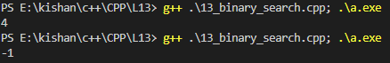

### **Binary Search Algorithm** 🚀  

---

### **1️⃣ What is Binary Search?**  

Binary Search is an efficient algorithm to search for an element in a **sorted array**. It repeatedly divides the search interval in half, significantly reducing the number of comparisons.  

---

### **2️⃣ Practical Use of Binary Search**  

1. **Searching in Sorted Data**:  
   - Example: Finding a word in a dictionary or a number in a sorted list.  

2. **Optimization Problems**:  
   - Example: Finding the smallest/largest element that satisfies a condition in a sorted range.  

3. **Applications**:  
   - Searching in databases.  
   - Solving problems involving ranges, like finding the square root of a number.  

---

### **3️⃣ Linear Search vs. Binary Search**  

| **Property**       | **Linear Search**           | **Binary Search**                |  
|---------------------|-----------------------------|-----------------------------------|  
| **Applicability**   | Any unsorted or sorted array| Only sorted arrays (ascending/descending) |  
| **Time Complexity** | \( O(n) \)                 | \( O(\log n) \)                  |  
| **Performance**     | Slower for large datasets  | Much faster for large datasets   |  

---

### **4️⃣ Binary Search: Iterative Approach**  

#### **Code**:  
```cpp  
int binarySearch(vector<int> arr, int tar) {  
    int st = 0, end = arr.size() - 1;  

    while (st <= end) {  
        int mid = st + (end - st) / 2;  // Prevents overflow  

        if (tar > arr[mid]) {  
            st = mid + 1;  // Target is in the right half  
        } else if (tar < arr[mid]) {  
            end = mid - 1;  // Target is in the left half  
        } else {  
            return mid;  // Found target  
        }  
    }  

    return -1;  // Target not found  
}  

int main() {  
    vector<int> arr = {-1, 0, 3, 5, 9, 12};  
    int tar = 9;  

    cout << "Index of target: " << binarySearch(arr, tar) << endl;  // Outputs: 4  

    return 0;  
}  
```  

#### **Output Example**  
- **Input**: Array = `[-1, 0, 3, 5, 9, 12]`, Target = `9`.  
- **Output**: Index = `4`.  

---

### **5️⃣ Binary Search: Recursive Approach**  

#### **Code**:  
```cpp  
int binarySearchRecursive(vector<int>& arr, int st, int end, int tar) {  
    if (st > end) return -1;  // Base case: Target not found  

    int mid = st + (end - st) / 2;  // Prevents overflow  

    if (tar == arr[mid]) return mid;  // Found target  
    if (tar > arr[mid]) return binarySearchRecursive(arr, mid + 1, end, tar);  
    return binarySearchRecursive(arr, st, mid - 1, tar);  
}  

int main() {  
    vector<int> arr = {-1, 0, 3, 5, 9, 12};  
    int tar = 0;  

    cout << "Index of target: " << binarySearchRecursive(arr, 0, arr.size() - 1, tar) << endl;  // Outputs: 1  

    return 0;  
}  
```  

---

### **6️⃣ Handling Overflow in Binary Search**  

#### **Issue**  
- Calculating `mid` as:  
  ```cpp  
  int mid = (st + end) / 2;  
  ```  
  This can cause **integer overflow** when `st` and `end` are large.  

#### **Optimized Formula**  
- Instead, calculate `mid` as:  
  ```cpp  
  int mid = st + (end - st) / 2;  
  ```  
  This avoids overflow by subtracting `st` before adding it back.  

---

### **7️⃣ Complexity Analysis**  

1. **Time Complexity**:  
   - The search interval is halved in each step.  
   - Total comparisons: \( \log_2(n) \).  
   \[
   O(\log n)
   \]  

2. **Space Complexity**:  
   - Iterative: \( O(1) \).  
   - Recursive: \( O(\log n) \) (due to recursion stack).  

---

### **8️⃣ Edge Cases**  

1. **Empty Array**:  
   - Input: `arr = []`, `tar = 5`.  
   - Output: `-1`.  

2. **Target Not in Array**:  
   - Input: `arr = [1, 2, 3, 4]`, `tar = 0`.  
   - Output: `-1`.  

3. **Target at Bounds**:  
   - Input: `arr = [1, 2, 3, 4, 5]`, `tar = 5`.  
   - Output: Index = `4`.  

---

### **Key Takeaways**  

1. Binary search is more efficient than linear search for sorted data.  
2. Always use the optimized formula to calculate `mid` to prevent overflow.  
3. Use recursion for a cleaner implementation but keep in mind its higher space complexity.  

---
### **Binary Search: Time Complexity and Recursive Implementation** 🚀  

---

### **1️⃣ Time Complexity of Binary Search**  

Binary search is more efficient than linear search because it reduces the search space by half with each comparison.  

#### **Example: Comparison Between Linear and Binary Search**  
1. **Linear Search**:  
   - For an array with 10 elements, up to 10 operations may be required (in the worst case).  

2. **Binary Search**:  
   - The search space reduces as: \( n, n/2, n/4, n/8, \ldots, 1 \).  
   - For 10 elements, binary search requires \( \lceil \log_2(10) \rceil = 4 \) operations.  

---

#### **Mathematical Derivation**  

- After \( k \) steps, the size of the search space reduces to \( \frac{n}{2^k} \).  
- When the search space becomes 1:  
  \[
  \frac{n}{2^k} = 1
  \]  
- Rearrange:  
  \[
  n = 2^k
  \]  
- Taking the logarithm (base 2) of both sides:  
  \[
  \log_2(n) = k
  \]  

#### **Time Complexity**  
- Binary search requires \( k = \log_2(n) \) comparisons.  
- Therefore:  
  \[
  \text{Time Complexity} = O(\log n)
  \]  

---

### **2️⃣ Recursive Implementation of Binary Search**  

#### **Key Idea**  
Binary search can also be implemented recursively by repeatedly dividing the array into smaller halves until the target element is found.  

---

#### **Recursive Code**  

```cpp  
#include <iostream>  
#include <vector>  
using namespace std;  

int binarySearchRecursive(vector<int>& arr, int st, int end, int tar) {  
    if (st > end) return -1;  // Base case: Target not found  

    int mid = st + (end - st) / 2;  // Calculate mid to prevent overflow  

    if (arr[mid] == tar) return mid;  // Found target  
    if (arr[mid] < tar)  
        return binarySearchRecursive(arr, mid + 1, end, tar);  // Search right half  
    return binarySearchRecursive(arr, st, mid - 1, tar);  // Search left half  
}  

int main() {  
    vector<int> arr = {-1, 0, 3, 5, 9, 12};  
    int tar = 9;  

    int result = binarySearchRecursive(arr, 0, arr.size() - 1, tar);  
    if (result != -1)  
        cout << "Target found at index: " << result << endl;  
    else  
        cout << "Target not found" << endl;  

    return 0;  
}  
```  

---

#### **Explanation**  

1. **Base Case**:  
   - If \( st > end \), the target element is not in the array.  

2. **Recursive Calls**:  
   - If the target is greater than `arr[mid]`, recursively search in the right half.  
   - If the target is less than `arr[mid]`, recursively search in the left half.  

---

#### **Complexity Analysis**  

1. **Time Complexity**:  
   - The array is divided in half with each recursive call.  
   \[
   O(\log n)
   \]  

2. **Space Complexity**:  
   - Each recursive call adds a frame to the call stack.  
   - The maximum depth of the recursion tree is \( \log_2(n) \).  
   \[
   O(\log n)
   \]  

---

### **3️⃣ Comparison: Iterative vs Recursive Binary Search**  

| **Aspect**            | **Iterative**                     | **Recursive**                     |  
|------------------------|------------------------------------|------------------------------------|  
| **Implementation**     | Uses loops for iteration.         | Uses function calls.               |  
| **Time Complexity**    | \( O(\log n) \)                   | \( O(\log n) \)                   |  
| **Space Complexity**   | \( O(1) \) (no stack usage)       | \( O(\log n) \) (stack usage)      |  
| **Use Case**           | Preferred for memory efficiency.  | Preferred for cleaner code.        |  

---

### **4️⃣ Example with Recursive Binary Search**  

#### **Input**:  
Array = `[-1, 0, 3, 5, 9, 12]`, Target = `9`.  

#### **Execution Steps**:  

1. **Initial Call**:  
   - \( st = 0, end = 5, mid = 2 \).  
   - \( arr[mid] = 3 \), \( tar > arr[mid] \).  
   - Recursive call on \( [5, 9, 12] \).  

2. **Second Call**:  
   - \( st = 3, end = 5, mid = 4 \).  
   - \( arr[mid] = 9 \), \( tar = arr[mid] \).  
   - Return \( 4 \).  

#### **Output**:  
```
Target found at index: 4
```  

---

### **Key Takeaways**  

1. Binary search reduces the problem size logarithmically, making it far more efficient than linear search.  
2. Recursive binary search is elegant but consumes more memory due to the call stack.  
3. Always handle overflow while calculating `mid` using \( \text{mid} = \text{st} + (\text{end} - \text{st}) / 2 \).  

### **Binary Search in Rotated Sorted Array** 🚀  

A rotated sorted array is an array that has been shifted from its sorted order at a pivot point. For example:  
- Original: `[1, 2, 3, 4, 5, 6]`  
- Rotated: `[4, 5, 6, 1, 2, 3]`.  

The challenge is to apply **binary search** in this array efficiently.  

---

### **Key Idea**  
1. Even though the array is rotated, at least one of the two halves (left or right) will always be sorted.  
2. Use binary search to determine which half is sorted, then decide whether to search in the sorted or unsorted half.  

---

### **Algorithm**  
1. Start with two pointers: `start` and `end`.  
2. Calculate the middle index:  
   \[
   \text{mid} = \text{start} + (\text{end} - \text{start}) / 2
   \]  
3. Check if `arr[mid]` is the target:  
   - If true, return the index.  
4. Determine if the left half is sorted:  
   - If `arr[start] <= arr[mid]`, the left half is sorted.  
5. Check if the target lies within the sorted half:  
   - If yes, narrow the search to the sorted half.  
   - If no, search in the unsorted half.  
6. Repeat until `start > end`.  

---

### **Example Execution**  

#### **Input**:  
`arr = [4, 5, 6, 7, 0, 1, 2]`, `target = 0`.  

#### **Steps**:  
1. `start = 0`, `end = 6`, `mid = 3` → `arr[mid] = 7`.  
   - Left half `[4, 5, 6, 7]` is sorted.  
   - Target is not in `[4, 5, 6, 7]`.  
   - Narrow search to `[0, 1, 2]`.  

2. `start = 4`, `end = 6`, `mid = 5` → `arr[mid] = 1`.  
   - Right half `[1, 2]` is sorted.  
   - Target is in `[0, 1, 2]`.  
   - Narrow search to `[0]`.  

3. `start = 4`, `end = 4`, `mid = 4` → `arr[mid] = 0`.  
   - Target found at index `4`.  

#### **Output**:  
```
Target found at index: 4
```  

---

### **Time and Space Complexity**  

1. **Time Complexity**:  
   - Similar to standard binary search:  
   \[
   O(\log n)
   \]  

2. **Space Complexity**:  
   - No additional memory used.  
   \[
   O(1)
   \]  

---

### **Edge Cases**  

1. **Target Not in Array**:  
   - Input: `[4, 5, 6, 7, 0, 1, 2]`, Target = `3`.  
   - Output: `-1`.  

2. **Array with One Element**:  
   - Input: `[1]`, Target = `1`.  
   - Output: `0`.  

3. **Array Without Rotation**:  
   - Input: `[1, 2, 3, 4, 5]`, Target = `3`.  
   - Output: `2`.  

4. **Duplicates in Array**:  
   - If duplicates exist, additional logic is needed to handle ambiguous cases.  

---

### **Key Takeaways**  

1. Binary search in a rotated array relies on identifying the sorted half of the array.  
2. Efficiently narrows down the search space with \( O(\log n) \) time complexity.  
3. Always handle edge cases like single-element arrays and unrotated arrays. 

### **Leetcode link** 
https://leetcode.com/problems/search-in-rotated-sorted-array/


### **Peak Index in Mountain Array** 🚀  

A **mountain array** is defined as an array where elements strictly increase to a peak and then strictly decrease. The task is to find the **peak index** in the mountain array.

---

### **Example**  
**Input**:  
`arr = [1, 3, 5, 4, 2]`  
**Output**:  
`2` (Peak element is `5` at index `2`).  

---

### **Approach: Binary Search for Peak Index**  

#### **Key Observations**  
1. In a mountain array, the peak element is larger than its neighbors.  
2. Use binary search to narrow down the search space based on the slope:  
   - If `arr[mid] < arr[mid + 1]`, the peak lies to the right.  
   - If `arr[mid] > arr[mid + 1]`, the peak lies to the left.  

#### **Algorithm**  
1. Initialize `start = 0` and `end = arr.size() - 1`.  
2. Calculate `mid = start + (end - start) / 2`.  
3. Compare `arr[mid]` and `arr[mid + 1]`:  
   - If `arr[mid] < arr[mid + 1]`, move `start` to `mid + 1`.  
   - Otherwise, move `end` to `mid`.  
4. When `start == end`, the peak index is found.   

---

### **Explanation**  

#### **Input**:  
`arr = [1, 3, 5, 4, 2]`  

#### **Execution Steps**  

1. **Initial State**:  
   - `start = 0`, `end = 4`.  

2. **First Iteration**:  
   - `mid = 2`.  
   - `arr[mid] = 5`, `arr[mid + 1] = 4`.  
   - Since `arr[mid] > arr[mid + 1]`, move `end = mid`.  

3. **Second Iteration**:  
   - `start = 0`, `end = 2`, `mid = 1`.  
   - `arr[mid] = 3`, `arr[mid + 1] = 5`.  
   - Since `arr[mid] < arr[mid + 1]`, move `start = mid + 1`.  

4. **Final State**:  
   - `start = 2`, `end = 2`.  
   - Peak index is `2`.  

---

### **Complexity Analysis**  

1. **Time Complexity**:  
   - Binary search reduces the search space logarithmically.  
   \[
   O(\log n)
   \]  

2. **Space Complexity**:  
   - No additional memory is used.  
   \[
   O(1)
   \]  

---

### **Edge Cases**  

1. **Short Mountain Array**:  
   - Input: `[0, 1, 0]`.  
   - Output: `1`.  

2. **All Elements Increasing Before Decreasing**:  
   - Input: `[1, 2, 3, 4, 5, 4, 3, 2, 1]`.  
   - Output: `4`.  

3. **Larger Arrays**:  
   - Input: `[1, 2, 3, ..., 1000, 999, ..., 1]`.  
   - Output: Index of `1000`.  

---

### **Key Takeaways**  

1. Binary search is an efficient way to find the peak in a mountain array with \( O(\log n) \) time complexity.  
2. Always consider edge cases like short arrays or larger inputs for robust solutions.  
3. The algorithm works only for valid mountain arrays with a single peak.  

### **Leetcode link** 
https://leetcode.com/problems/peak-index-in-a-mountain-array/

## outputs
 
