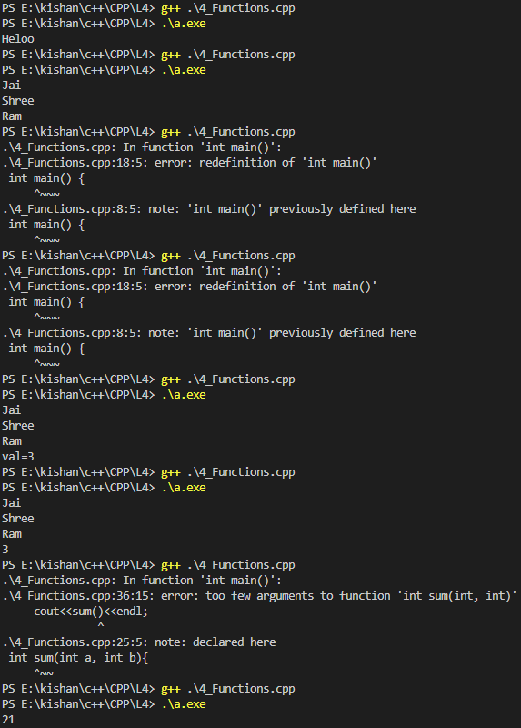
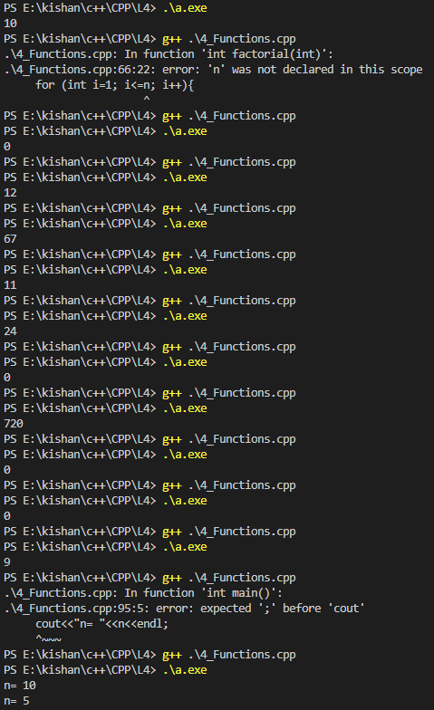

### **Functions in C++** 🚀  

Functions in C++ allow us to encapsulate repetitive tasks into reusable blocks of code. This improves readability, reduces redundancy, and simplifies debugging.  

---

### **Why Use Functions?**  
🔹 To avoid writing repetitive code.  
🔹 To divide a program into smaller, manageable parts.  
🔹 To improve code reusability and organization.  

---

### **Function Basics**  

#### **1️⃣ Function Syntax**  
```cpp  
returnType functionName(parameters) {  
    // Function body  
    return value;  // (if required)  
}  
```  

- **`returnType`:** Specifies the type of value the function returns (e.g., `int`, `float`, `void`).  
- **`functionName`:** The name of the function.  
- **`parameters`:** The inputs to the function, written inside parentheses.  
- **`return`:** Ends the function and optionally returns a value.  

**Example:**  
```cpp  
void printHello() {  
    cout << "Hello";  
}  

int addNumbers(int a, int b) {  
    return a + b;  
}  
```  

---

### **2️⃣ Function Types**  

1. **Void Functions:**  
   - Do not return any value.  
   - Used for printing or performing actions.  

   **Example:**  
   ```cpp  
   void sayHi() {  
       cout << "Hi there!";  
   }  
   ```  

2. **Functions with Return Values:**  
   - Return a value of the specified type (e.g., `int`, `float`).  
   - The return type must match the value being returned.  

   **Example:**  
   ```cpp  
   int multiply(int x, int y) {  
       return x * y;  
   }  
   ```  

---

### **3️⃣ Function Parameters**  

- **Parameters:** Inputs passed to a function, defined within parentheses.  
- **Arguments:** Actual values provided when calling the function.  

**Example:**  
```cpp  
int subtract(int a, int b) {  
    return a - b;  
}  

int main() {  
    int result = subtract(10, 4);  // Arguments: 10 and 4  
    cout << "Result: " << result;  
}  
```  

---

### **4️⃣ Function Calls**  
🔹 A function must be **called** to execute.  
🔹 The **main function** is the entry point of every C++ program.  

**Example:**  
```cpp  
void greet() {  
    cout << "Hello, World!";  
}  

int main() {  
    greet();  // Function call  
    return 0;  
}  
```  

---

### **Memory and Functions**  

#### **1️⃣ Stack Memory (Static Allocation)**  
- **Stack Frame:** Each function call creates a frame in stack memory.  
- **Memory Allocation:** Variables related to the function are stored in the stack.  
- **Execution Order:**  
  1. When a function is called, a new frame is pushed onto the stack.  
  2. When the function completes, its frame is popped from the stack, and control returns to the previous frame.  
  3. The **current function** is always on top of the stack.  

**Example:**  
```cpp  
void funcA() {  
    cout << "Function A";  
}  

void funcB() {  
    funcA();  // Calls funcA  
    cout << "Function B";  
}  

int main() {  
    funcB();  
    return 0;  
}  
```  

**Flow:**  
1. `main` frame → calls `funcB` → pushes `funcB` frame.  
2. `funcB` frame → calls `funcA` → pushes `funcA` frame.  
3. `funcA` completes → `funcB` resumes → `main` resumes.  

#### **2️⃣ Heap Memory (Dynamic Allocation)**  
- Used for memory allocated at runtime (e.g., using `new` or `malloc`).  
- Managed explicitly by the programmer.  

---

### **Ways to Pass Arguments**  

#### **1️⃣ Pass by Value**  
- A **copy** of the argument is passed to the function.  
- Changes made inside the function do not affect the original variable.  

**Example:**  
```cpp  
void changeValue(int x) {  
    x = 10;  
}  

int main() {  
    int a = 5;  
    changeValue(a);  
    cout << a;  // Outputs: 5  
}  
```  

#### **2️⃣ Pass by Reference**  
- The function receives a **reference** to the original variable.  
- Changes made inside the function affect the original variable.  

**Example:**  
```cpp  
void changeValue(int &x) {  
    x = 10;  
}  

int main() {  
    int a = 5;  
    changeValue(a);  
    cout << a;  // Outputs: 10  
}  
```  

---

### **Practice Problems**  

#### **1️⃣ Find the Sum of Digits of a Number**  
**Problem:** Write a function to calculate the sum of digits of a number.  

**Code:**  
```cpp  
int sumOfDigits(int num) {  
    int sum = 0;  
    while (num > 0) {  
        sum += num % 10;  
        num /= 10;  
    }  
    return sum;  
}  

int main() {  
    cout << sumOfDigits(123);  // Outputs: 6  
}  
```  

---

#### **2️⃣ Calculate Binomial Coefficient (nCr)**  
**Formula:**  
\[ nCr = \frac{n!}{r! \cdot (n-r)!} \]  

**Code:**  
```cpp  
int factorial(int n) {  
    int fact = 1;  
    for (int i = 1; i <= n; i++) {  
        fact *= i;  
    }  
    return fact;  
}  

int binomialCoefficient(int n, int r) {  
    return factorial(n) / (factorial(r) * factorial(n - r));  
}  

int main() {  
    cout << binomialCoefficient(5, 2);  // Outputs: 10  
}  
```  

---

### **Key Takeaways**  
- Functions simplify repetitive tasks and improve code organization.  
- Use **stack memory** for static allocation and **heap memory** for dynamic needs.  
- Master passing arguments by value and by reference to handle different scenarios.  
- Practice implementing functions to solve real-world problems!  

### **Homework: Functions in C++** 📝  

Here are some practice problems to reinforce your understanding of functions. Write and implement these using C++:  

---

### **1️⃣ Write a Function to Check if a Number is Prime**  
🔹 A prime number is only divisible by 1 and itself.  

**Example Input:** `7`  
**Example Output:** `Prime`  

**Hint:**  
- Loop from 2 to `sqrt(n)`.  
- If the number is divisible by any value in this range, it's not prime.  

---

### **2️⃣ Write a Function to Print All Prime Numbers from 2 to n**  
🔹 Generate all prime numbers up to a given number `n`.  

**Example Input:** `10`  
**Example Output:** `2, 3, 5, 7`  

**Hint:**  
- Use a loop to iterate from 2 to `n`.  
- For each number, check if it’s prime using the function from Problem 1.  

---

### **3️⃣ Write a Function to Print the nth Fibonacci Number**  
🔹 Fibonacci sequence: `0, 1, 1, 2, 3, 5, 8, 13...`  
- The nth Fibonacci number is the sum of the two preceding numbers.  
- Base cases: `F(0) = 0`, `F(1) = 1`.  

**Example Input:** `5`  
**Example Output:** `5`  

**Hint:**  
- Use recursion or iteration.  
- For recursion: Define `fib(n) = fib(n-1) + fib(n-2)`.  

---

### **Optional Challenge** 🌟  
🔹 Write a function to calculate the sum of all prime numbers up to `n`.  

**Example Input:** `10`  
**Example Output:** `2 + 3 + 5 + 7 = 17`  

**Hint:**  
- Combine the logic from Problems 1 and 2.  

---

### **Key Takeaways**  
- These problems will help you master loops, conditional statements, and function calls in C++.  
- Practice writing modular code to make programs easier to debug and maintain.  

Also you can cover! 😊✨
### **Switch Statements in C++** 🚀  

A **`switch` statement** is an alternative to multiple `if-else` conditions. It evaluates a single expression and matches it against multiple cases. Each case has a block of code that runs when matched.  

---

### **Syntax**  
```cpp  
switch (expression) {  
    case value1:  
        // Code to execute if expression == value1  
        break;  
    case value2:  
        // Code to execute if expression == value2  
        break;  
    ...  
    default:  
        // Code to execute if no cases match  
}  
```  

---

### **Key Points**  
1. **Expression:** The `switch` statement evaluates an integer, character, or enumeration value.  
2. **Cases:** Each `case` is checked against the expression.  
3. **Break Statement:**  
   - Ends the current case and exits the `switch` block.  
   - Without `break`, execution will "fall through" to subsequent cases.  
4. **Default Case:** Executes if no other cases match (optional but recommended).  

---

### **Example: Days of the Week**  
**Problem:** Take an integer input (1–7) and print the corresponding day of the week.  

```cpp  
#include <iostream>  
using namespace std;  

int main() {  
    int day;  
    cout << "Enter a number (1-7): ";  
    cin >> day;  

    switch (day) {  
        case 1:  
            cout << "Monday";  
            break;  
        case 2:  
            cout << "Tuesday";  
            break;  
        case 3:  
            cout << "Wednesday";  
            break;  
        case 4:  
            cout << "Thursday";  
            break;  
        case 5:  
            cout << "Friday";  
            break;  
        case 6:  
            cout << "Saturday";  
            break;  
        case 7:  
            cout << "Sunday";  
            break;  
        default:  
            cout << "Invalid input! Please enter a number between 1 and 7.";  
    }  

    return 0;  
}  
```  
**Output:**  
- Input: `3`  
  Output: `Wednesday`  
- Input: `8`  
  Output: `Invalid input! Please enter a number between 1 and 7.`  

---

### **Example: Simple Calculator**  
**Problem:** Perform addition, subtraction, multiplication, or division based on user input.  

```cpp  
#include <iostream>  
using namespace std;  

int main() {  
    int num1, num2;  
    char operation;  

    cout << "Enter two numbers: ";  
    cin >> num1 >> num2;  
    cout << "Enter operation (+, -, *, /): ";  
    cin >> operation;  

    switch (operation) {  
        case '+':  
            cout << "Result: " << num1 + num2;  
            break;  
        case '-':  
            cout << "Result: " << num1 - num2;  
            break;  
        case '*':  
            cout << "Result: " << num1 * num2;  
            break;  
        case '/':  
            if (num2 != 0)  
                cout << "Result: " << num1 / num2;  
            else  
                cout << "Error: Division by zero!";  
            break;  
        default:  
            cout << "Invalid operation!";  
    }  

    return 0;  
}  
```  
**Output:**  
- Input: `10, 5, *`  
  Output: `Result: 50`  
- Input: `8, 0, /`  
  Output: `Error: Division by zero!`  

---

### **Homework: Practice Problems with Switch Statements**  

#### **1️⃣ Write a Program to Check Vowel or Consonant**  
- Input: A single character.  
- Output: Whether it is a vowel (`a, e, i, o, u`) or consonant.  

---

#### **2️⃣ Create a Menu-Driven Program**  
- Display a menu for basic arithmetic operations.  
- Take user input for two numbers and an operation.  
- Use a `switch` statement to execute the operation.  

---

#### **3️⃣ Write a Program to Determine the Type of Triangle**  
- Input: Three angles of a triangle.  
- Output: Whether it is an equilateral, isosceles, or scalene triangle.  

---

### **Key Takeaways**  
- Use `switch` for multiple fixed-value conditions.  
- Remember to add `break` to avoid unintended fall-through.  
- Include a `default` case for unmatched condition.  

### **Outputs**

<table>
  <tr>
    <td></td>
    <td></td>
  </tr>


Happy Coding! 😊✨  