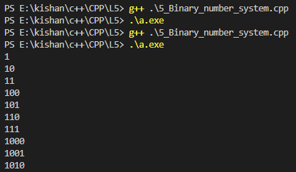

### **Binary Number System in C++** 🚀  

Binary is the foundation of computer systems. Computers use binary (0 and 1) to store and process data because it aligns with the digital nature of their hardware. Let’s dive into the binary system, conversions, and related concepts.  

---

### **Number Systems Overview**  

1️⃣ **Binary Number System (Base 2):**  
- Uses only `0` and `1`.  
- Example: `1010` (binary).  

2️⃣ **Octal Number System (Base 8):**  
- Uses digits from `0` to `7`.  
- Example: `57` (octal).  

3️⃣ **Hexadecimal Number System (Base 16):**  
- Uses digits from `0-9` and letters `A-F` for values 10-15.  
- Example: `2A` (hexadecimal).  

4️⃣ **Decimal Number System (Base 10):**  
- The standard system we use in mathematics.  
- Example: `132246` (decimal).  

---

### **Binary to Decimal Conversion**  
To convert binary to decimal:  
1. Multiply each binary digit by \( 2^{\text{position}} \), starting from the right (position 0).  
2. Sum up the results.  

**Example:** Convert `1010` to decimal.  
\[ 1010 = (1 \times 2^3) + (0 \times 2^2) + (1 \times 2^1) + (0 \times 2^0) \]  
\[ 1010 = 8 + 0 + 2 + 0 = 10 \]  

---

### **Decimal to Binary Conversion**  
To convert decimal to binary:  
1. Divide the number by 2.  
2. Record the remainder (0 or 1).  
3. Repeat until the quotient is 0.  
4. Write the remainders in reverse order.  

**Example:** Convert `25` to binary.  
- \( 25 \div 2 = 12 \) remainder `1`  
- \( 12 \div 2 = 6 \) remainder `0`  
- \( 6 \div 2 = 3 \) remainder `0`  
- \( 3 \div 2 = 1 \) remainder `1`  
- \( 1 \div 2 = 0 \) remainder `1`  

Binary: `11001`  

---

### **Binary Table for Numbers 0 to 10**  

| Decimal | Binary   |  
|---------|----------|  
| 0       | 0000     |  
| 1       | 0001     |  
| 2       | 0010     |  
| 3       | 0011     |  
| 4       | 0100     |  
| 5       | 0101     |  
| 6       | 0110     |  
| 7       | 0111     |  
| 8       | 1000     |  
| 9       | 1001     |  
| 10      | 1010     |  

---

### **Two's Complement in Binary**  

Two’s complement is used to represent negative numbers in binary.  

#### **Steps to Calculate Two’s Complement:**  
1. Convert the number to binary.  
   - For \( n = -10 \), first find \( 10 \) in binary: `1010`.  
2. Pad the binary number to 32 bits (for integers) and prefix it with `0`.  
   - Binary becomes `0000 0000 0000 0000 0000 0000 0000 1010`.  
3. Find the **1’s complement**: Replace `0` with `1` and `1` with `0`.  
   - \( 1010 \) → `1111 1111 1111 1111 1111 1111 1111 0101`.  
4. Add 1 to the result.  
   - \( 1111 1111 1111 1111 1111 1111 1111 0101 + 1 \) → `1111 1111 1111 1111 1111 1111 1111 0110`.  

This is the binary representation of `-10` in two’s complement.  

---

### **Converting Binary to Decimal (Two's Complement)**  

To convert a negative binary number to decimal:  
1. Check if the MSB (most significant bit) is `1` (indicating it’s negative).  
2. Find the **two’s complement** (reverse the steps).  
3. Convert the result to decimal and add the negative sign.  

**Example:** Convert `11111000` (binary) to decimal.  
1. MSB is `1`, so it’s negative.  
2. Find the **1’s complement**: `00000111`.  
3. Add 1: \( 00000111 + 1 = 00001000 \).  
4. Convert to decimal: `8`.  
5. Add the negative sign: `-8`.  

Result: `-8`.  

---

### **Practice Problems**  

#### **1️⃣ Convert Decimal to Binary:**  
Find the binary form of:  
- \( 6 \)  
- \( 15 \)  

#### **2️⃣ Convert Binary to Decimal:**  
Find the decimal form of:  
- \( 10101 \)  
- \( 11011 \)  

#### **3️⃣ Two’s Complement Practice:**  
Find the two’s complement for:  
- \( -7 \)  
- \( -12 \)  

#### **4️⃣ Reverse Conversion:**  
Convert back from two’s complement binary to decimal for:  
- \( 11111001 \)  
- \( 11111100 \)  

---

### **Key Takeaways**  
- Binary is the base of all computing systems.  
- Two’s complement is crucial for representing negative numbers.  
- Practice conversions to master binary systems and memory representation.  

### **Output**

<table>
  <tr>
    <td></td>
  </tr>

Happy Coding! 😊✨  