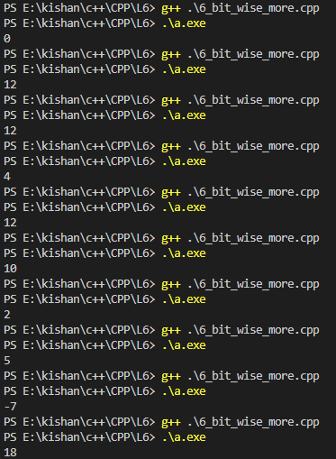
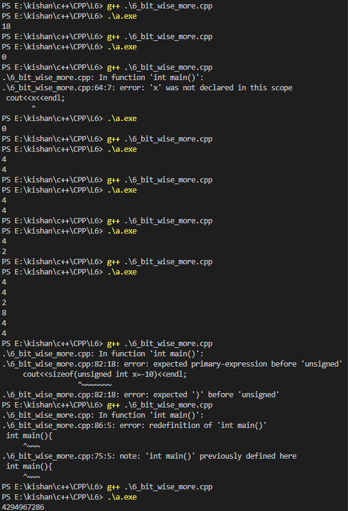

### **Bitwise Operators, Scope of Variables, Data Type Modifiers, and More in C++** 🚀  

In this guide, we’ll cover some essential and miscellaneous concepts in C++ to sharpen your understanding of operators, scopes, and modifiers.  

---

### **Bitwise Operators**  
Bitwise operators work directly on binary representations of numbers.  

| Operator | Symbol | Description                  | Example         | Binary Output         |  
|----------|--------|------------------------------|-----------------|-----------------------|  
| AND      | `&`    | Performs bit-by-bit AND     | `5 & 3`         | `0101 & 0011 = 0001`  |  
| OR       | `|`    | Performs bit-by-bit OR      | `5 | 3`         | `0101 | 0011 = 0111`  |  
| XOR      | `^`    | Performs bit-by-bit XOR     | `5 ^ 3`         | `0101 ^ 0011 = 0110`  |  
| Left Shift | `<<`  | Shifts bits to the left     | `5 << 1`        | `0101 << 1 = 1010`    |  
| Right Shift | `>>` | Shifts bits to the right    | `5 >> 1`        | `0101 >> 1 = 0010`    |  

**Example in Code:**  
```cpp  
#include <iostream>  
using namespace std;  

int main() {  
    int a = 5, b = 3;  
    cout << "a & b: " << (a & b) << endl;  // Outputs: 1  
    cout << "a | b: " << (a | b) << endl;  // Outputs: 7  
    cout << "a ^ b: " << (a ^ b) << endl;  // Outputs: 6  
    cout << "a << 1: " << (a << 1) << endl;  // Outputs: 10  
    cout << "a >> 1: " << (a >> 1) << endl;  // Outputs: 2  
    return 0;  
}  
```  

---

### **Operator Precedence**  

Operator precedence determines the order in which operations are performed.  

**Example:** In the expression `a + b * c`, multiplication (`*`) is performed before addition (`+`) due to its higher precedence.  

---

#### **Precedence Table (Simplified)**  

| Priority | Operators                 | Associativity |  
|----------|---------------------------|---------------|  
| 1        | `!`, `~`, `++`, `--`      | Right to Left |  
| 2        | `*`, `/`, `%`             | Left to Right |  
| 3        | `+`, `-`                  | Left to Right |  
| 4        | `<<`, `>>`                | Left to Right |  
| 5        | `<`, `<=`, `>`, `>=`      | Left to Right |  
| 6        | `==`, `!=`                | Left to Right |  
| 7        | `&`                       | Left to Right |  
| 8        | `|`, `^`                  | Left to Right |  

**Overwriting Precedence:**  
Use parentheses `()` to control precedence explicitly.  

**Example:**  
```cpp  
int result = (5 + 3) * 2;  // Parentheses ensure addition is performed first.  
cout << result;  // Outputs: 16  
```  

---

### **Scope of Variables**  
Scope defines the region in a program where a variable can be accessed.  

#### **Types of Scope:**  

1️⃣ **Local Scope:**  
- Variables declared inside a function or block.  
- Accessible only within that block.  

**Example:**  
```cpp  
void localExample() {  
    int x = 10;  // Local variable  
    cout << "Local x: " << x;  
}  
```  

2️⃣ **Global Scope:**  
- Variables declared outside all functions.  
- Accessible throughout the program.  

**Example:**  
```cpp  
int x = 20;  // Global variable  

void globalExample() {  
    cout << "Global x: " << x;  
}  
```  

**Combined Example:**  
```cpp  
#include <iostream>  
using namespace std;  

int x = 20;  // Global variable  

void testScope() {  
    int x = 10;  // Local variable  
    cout << "Local x: " << x << endl;  
    cout << "Global x: " << ::x << endl;  // Use '::' to access global variable  
}  

int main() {  
    testScope();  
    return 0;  
}  
```  

---

### **Data Type Modifiers**  

Data type modifiers extend the meaning and range of data types.  

| Modifier    | Description                              | Example       |  
|-------------|------------------------------------------|---------------|  
| `long`      | Increases size (≥ 4 bytes)              | `long int`    |  
| `short`     | Reduces size (≤ 2 bytes)               | `short int`   |  
| `long long` | Provides extra-large range             | `long long`   |  
| `signed`    | Default for integers, allows negatives  | `signed int`  |  
| `unsigned`  | Only allows non-negative values         | `unsigned int`|  

---

### **Homework: Practice Problems**  

#### **1️⃣ Practice Bitwise Operators:**  
1. Compute the binary AND, OR, XOR for two numbers (e.g., `6` and `3`).  
2. Perform left and right shifts on `10`.  

---

#### **2️⃣ Practice Operator Precedence:**  
1. Write an expression with at least three operators and test precedence.  
2. Use parentheses to alter the result.  

---

#### **3️⃣ Scope of Variables:**  
1. Write a program demonstrating the difference between local and global scope.  
2. Use `::` to access a global variable when a local variable of the same name exists.  

---

#### **4️⃣ Data Type Modifiers:**  
1. Create variables with `long`, `short`, `unsigned`, and `signed` modifiers.  
2. Test their sizes using `sizeof()`.  

---

### **Key Takeaways**  
- Use bitwise operators for efficient low-level operations.  
- Understand operator precedence to write clean and bug-free expressions.  
- Manage variable accessibility using scopes effectively.  
- Data type modifiers help fine-tune memory usage and range.   

### **outputs**
<table>
  <tr>
    <td></td>
    <td></td>
  </tr>

Happy Coding! 😊✨  