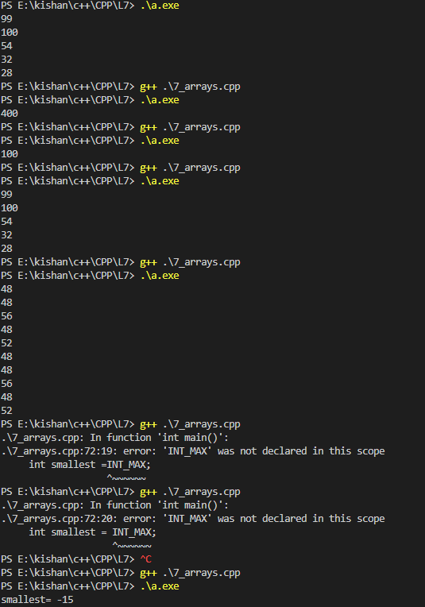
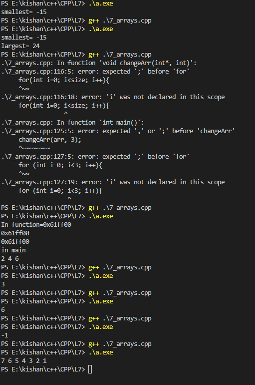

### **Array Data Structure in C++** 🚀  

An **array** is one of the most fundamental and widely used data structures in programming. It is a collection of elements stored in contiguous memory locations, all of the same data type.  

---

### **What is a Data Structure?**  
- A **data structure** is a way to organize and store data for efficient access and modification.  
- **Data:** The fuel for any development or computational task.  
- Data structures are categorized into:  
  1. **Linear:** Arrays, linked lists, stacks, queues.  
  2. **Hierarchical:** Trees, graphs.  

---

### **Array Basics**  

1️⃣ **Definition:**  
An array is a block of memory where multiple variables of the same type are stored sequentially.  

2️⃣ **Syntax:**  
```cpp  
int arrayName[size];  
```  

3️⃣ **Example:**  
```cpp  
int marks[5];  // Array to store 5 integers  
```  

4️⃣ **Characteristics:**  
- Elements in an array are stored **contiguously** in memory.  
- Each element has an **index**, starting from `0`.  
- Arrays are **linear** structures.  

5️⃣ **Visual Representation:**  
Imagine an array `marks[5]` stored in memory:  
```
Index:     0    1    2    3    4  
Values:    90   85   88   92   95  
```  

---

### **Operations on Arrays**  

#### **1️⃣ Finding the Largest and Smallest Elements**  
To find the smallest and largest values in an array, use `<climits>` for constants like `INT_MAX`.  

**Code Example:**  
```cpp  
#include <iostream>  
#include <climits>  
using namespace std;  

int main() {  
    int arr[] = {3, 1, 4, 1, 5, 9};  
    int n = sizeof(arr) / sizeof(arr[0]);  
    int smallest = INT_MAX, largest = INT_MIN;  

    for (int i = 0; i < n; i++) {  
        if (arr[i] < smallest)  
            smallest = arr[i];  
        if (arr[i] > largest)  
            largest = arr[i];  
    }  

    cout << "Smallest: " << smallest << endl;  
    cout << "Largest: " << largest << endl;  
    return 0;  
}  
```  

---

#### **2️⃣ Passing Arrays to Functions (Pass by Reference)**  
- In C++, arrays are always passed by reference.  
- The **array name** is a pointer to the first element of the array.  
- Modifications made to the array inside a function are reflected in the original array.  

**Code Example:**  
```cpp  
void changeArr(int arr[], int size) {  
    for (int i = 0; i < size; i++) {  
        arr[i] = 2 * arr[i];  // Modify each element  
    }  
}  

int main() {  
    int arr[] = {1, 2, 3};  
    int size = sizeof(arr) / sizeof(arr[0]);  

    changeArr(arr, size);  

    cout << "Modified array: ";  
    for (int i = 0; i < size; i++) {  
        cout << arr[i] << " ";  // Outputs: 2 4 6  
    }  

    return 0;  
}  
```  

---

#### **3️⃣ Linear Search**  
Linear search is a simple algorithm for finding an element in an array.  

**Steps:**  
1. Loop through each element in the array.  
2. Compare the current element with the target.  
3. If a match is found, return the index.  

**Code Example:**  
```cpp  
int linearSearch(int arr[], int n, int target) {  
    for (int i = 0; i < n; i++) {  
        if (arr[i] == target)  
            return i;  // Return the index of the target  
    }  
    return -1;  // Return -1 if target not found  
}  

int main() {  
    int arr[] = {4, 2, 7, 5, 8};  
    int n = sizeof(arr) / sizeof(arr[0]);  
    int target = 8;  

    int result = linearSearch(arr, n, target);  
    if (result != -1)  
        cout << "Target found at index " << result << endl;  
    else  
        cout << "Target not found";  

    return 0;  
}  
```  

---

#### **4️⃣ Reversing an Array**  
To reverse an array, use a **two-pointer approach**:  
1. Use one pointer at the start and another at the end of the array.  
2. Swap the elements and move the pointers toward each other.  

**Code Example:**  
```cpp  
#include <algorithm>  // For std::swap  
using namespace std;  

void reverseArray(int arr[], int n) {  
    int start = 0, end = n - 1;  
    while (start < end) {  
        swap(arr[start], arr[end]);  
        start++;  
        end--;  
    }  
}  

int main() {  
    int arr[] = {1, 2, 3, 4, 5};  
    int n = sizeof(arr) / sizeof(arr[0]);  

    reverseArray(arr, n);  

    cout << "Reversed array: ";  
    for (int i = 0; i < n; i++) {  
        cout << arr[i] << " ";  // Outputs: 5 4 3 2 1  
    }  

    return 0;  
}  
```  

---

### **Homework: Practice Problems**  

#### **1️⃣ Linear Search:**  
- Write a function to search for a target value in an array and return its index.  

#### **2️⃣ Reverse an Array:**  
- Reverse an array of odd and even lengths and print the result.  

#### **3️⃣ Find the Second Largest Element:**  
- Write a function to find the second largest element in an array.  

#### **4️⃣ Sum of Array Elements:**  
- Write a function to calculate the sum of all elements in an array.  

#### **5️⃣ Check if Array is Sorted:**  
- Write a function to determine if an array is sorted in ascending order.  

---

### **Key Takeaways**  
- Arrays are linear data structures stored contiguously in memory.  
- Use loops for efficient operations on arrays.  
- Arrays are always passed by reference in C++.  
- Mastering array operations is crucial for solving many computational problems.  

### **outputs**
<table>
  <tr>
    <td></td>
    <td></td>
  </tr>

Happy Coding! 😊✨  