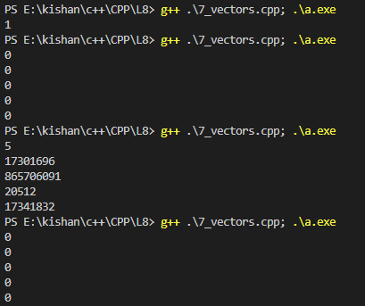
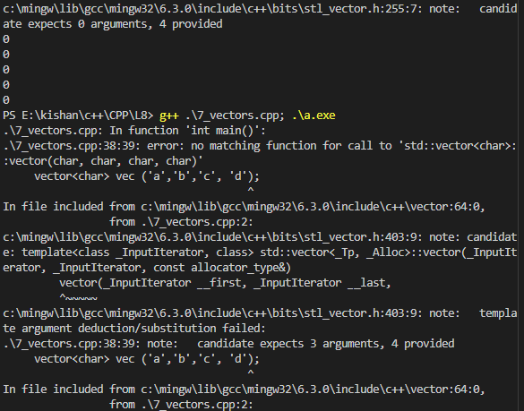
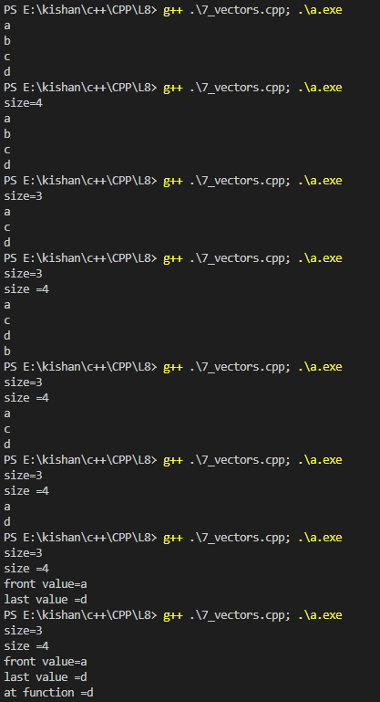
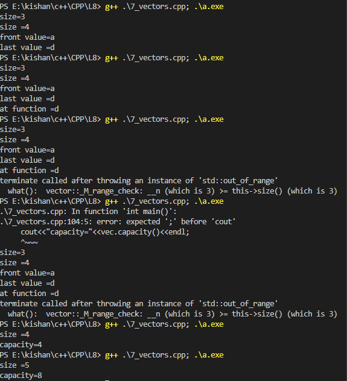

### **Vectors in C++** 🚀  

A **vector** is a dynamic data structure provided by the Standard Template Library (STL) in C++. It acts like an array but with the added advantage of dynamic resizing.  

---

### **What are Vectors?**  
1. **Array-like:**  
   - Vectors store elements in contiguous memory like arrays.  

2. **Dynamic Nature:**  
   - Unlike arrays, vectors can dynamically grow or shrink in size as needed.  

3. **Part of STL Containers:**  
   - STL includes various containers like `vector`, `queue`, `stack`, `set`, etc., and `vector` is one of them.  

4. **Declaration:**  
   ```cpp  
   #include <vector>  
   using namespace std;  

   vector<int> vec;  
   ```  

5. **Memory Representation:**  
   - Internally, vectors are like arrays, but they dynamically allocate memory when resized.  
   - Example:  
     ```cpp  
     vector<int> vec = {1, 2, 3};  
     cout << vec[0] << endl;  // Outputs: 1  
     ```  

---

### **Vector Functions**  

| **Function**       | **Description**                               | **Example**                                                |  
|---------------------|-----------------------------------------------|------------------------------------------------------------|  
| `size()`            | Returns the number of elements in the vector. | `cout << vec.size();`                                      |  
| `push_back(value)`  | Adds an element to the end of the vector.      | `vec.push_back(4);`                                        |  
| `pop_back()`        | Removes the last element of the vector.       | `vec.pop_back();`                                          |  
| `front()`           | Returns the first element of the vector.      | `cout << vec.front();`                                     |  
| `back()`            | Returns the last element of the vector.       | `cout << vec.back();`                                      |  
| `at(index)`         | Returns the element at a specific index.      | `cout << vec.at(2);`                                       |  

**Code Example:**  
```cpp  
#include <iostream>  
#include <vector>  
using namespace std;  

int main() {  
    vector<int> vec = {1, 2, 3};  

    cout << "Size: " << vec.size() << endl;  
    vec.push_back(4);  
    cout << "After push_back: " << vec.back() << endl;  
    vec.pop_back();  
    cout << "After pop_back: " << vec.size() << endl;  
    cout << "Front: " << vec.front() << endl;  
    cout << "Element at index 1: " << vec.at(1) << endl;  

    return 0;  
}  
```  

---

### **Static vs Dynamic Allocation**  

1️⃣ **Static Memory:**  
- Allocated during **compile time**.  
- Stored in **stack memory**.  
- Fixed size.  

2️⃣ **Dynamic Memory:**  
- Allocated during **runtime**.  
- Stored in **heap memory**.  
- Resizable.  

**Example with Vectors:**  
- When you use `push_back()` in a vector, the process involves:  
  1. Allocating a new array with increased size.  
  2. Copying old elements into the new array.  
  3. Deleting the old array.  

**Code Example:**  
```cpp  
#include <iostream>  
#include <vector>  
using namespace std;  

int main() {  
    vector<int> vec;  

    vec.push_back(0);  // Creates an array of size 1  
    vec.push_back(1);  // Creates a new array of size 2  
    vec.push_back(2);  // Creates a new array of size 3  

    for (int i : vec)  
        cout << i << " ";  // Outputs: 0 1 2  

    return 0;  
}  
```  

---

### **Difference Between Vector and Array**  

| **Feature**         | **Vector**                   | **Array**                  |  
|----------------------|------------------------------|----------------------------|  
| **Size**            | Dynamic (can resize)         | Static (fixed size)        |  
| **Memory**          | Stored in heap memory        | Stored in stack memory     |  
| **Ease of Use**     | Built-in functions available | Requires manual handling   |  
| **Performance**     | Slower due to dynamic nature | Faster for fixed-size data |  

---

### **Vector Properties: Size and Capacity**  

- **Size:** Number of elements currently in the vector.  
- **Capacity:** Total space allocated (may be greater than size).  

**Code Example:**  
```cpp  
#include <iostream>  
#include <vector>  
using namespace std;  

int main() {  
    vector<int> vec;  

    vec.push_back(1);  
    vec.push_back(2);  
    vec.push_back(3);  

    cout << "Size: " << vec.size() << endl;  
    cout << "Capacity: " << vec.capacity() << endl;  

    return 0;  
}  
```  

---

### **Problem: Single Number** (LeetCode)  

**Problem Statement:**  
Given a non-empty array of integers, every element appears twice except for one. Find that single number. 
 
**Leet_code_link**
- https://leetcode.com/problems/single-number/

**Example:**  
Input: `[4,1,2,1,2]`  
Output: `4`  

**Solution:**  
- Use bitwise XOR (`^`) since it cancels out duplicate numbers.  

**Code:**  
```cpp  
int singleNumber(vector<int>& nums) {  
    int result = 0;  
    for (int num : nums) {  
        result ^= num;  // XOR operation  
    }  
    return result;  
}  
```  

---

### **Homework: Practice Problems**  

1️⃣ **Insert and Remove Elements:**  
- Write a program to demonstrate the use of `push_back` and `pop_back` with vectors.  

2️⃣ **Reverse a Vector:**  
- Write a function to reverse a vector using two-pointer technique.  

3️⃣ **Dynamic Resizing:**  
- Create a vector, add elements dynamically, and observe changes in size and capacity.  

4️⃣ **Binary Search on a Sorted Vector:**  
- Write a function to implement binary search using vectors.  

---

### **Key Takeaways**  
- Vectors are dynamic and provide various built-in functions for easy manipulation.  
- They combine the flexibility of dynamic memory with the efficiency of arrays.  
- Practice using vectors to solve real-world problems efficiently.  

### **outputs**
<table>
  <tr>
    <td></td>
    <td></td>
    <td></td>
    <td></td>
  </tr>

Happy Coding! 😊✨  