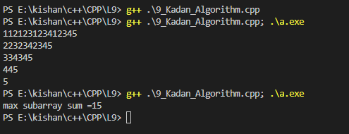

### **Vectors in C++** 🚀  
#Kadan's Algorithm
- will start with "Maximum subarray sum" 
- what is subarray: it is small part of array or continues part of array.
let say array is 1,2,3,4,5 all possible subarray 12,23,34,45 so on
so let say total element n then number of subarray is n*(n+1) / 2
no of element in array is 5 then no of sub array is 15
- sub array have starting and ending point. so we have to find all possible startand end points othat i can take out subarry form the array.
- so find all the sub array and take sum and then find the maximum.
- so here three loops running so time complexity is o(n3)
- so in "(Brute force approach)" it obsers common start point and add one end point the it remove one extra loop and time complexity reduce to o(n2).
- so to further reduce the time complexity we use most optimiaze approach by kadan's algo.
it work on intution ot two no sum. so autommatically check if you sum small positive and large negative value then it make no sense. so subarray is negative then it become zero.
- Here is the problem link of leet code: https://leetcode.com/problems/maximum-subarray/

### **outputs**
<table>
  <tr>
    <td></td>
    <td></td>
    <td></td>
    <td></td>
  </tr>

Happy Coding! 😊✨  